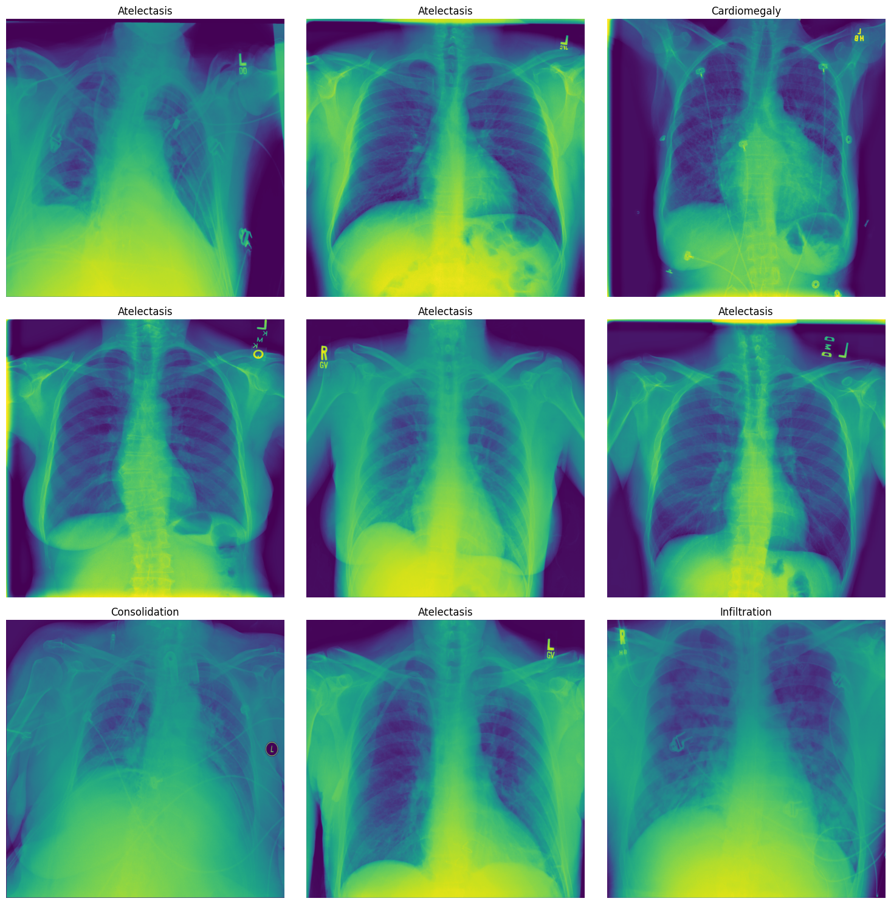
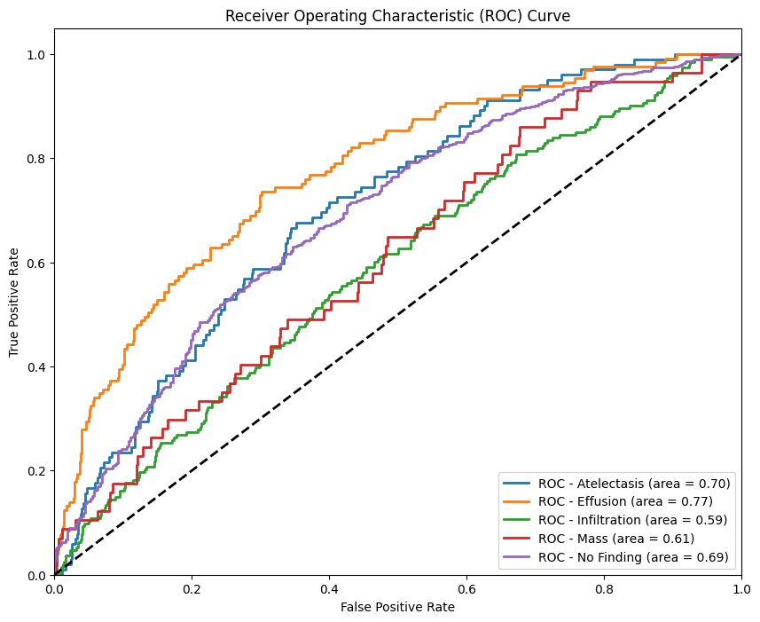
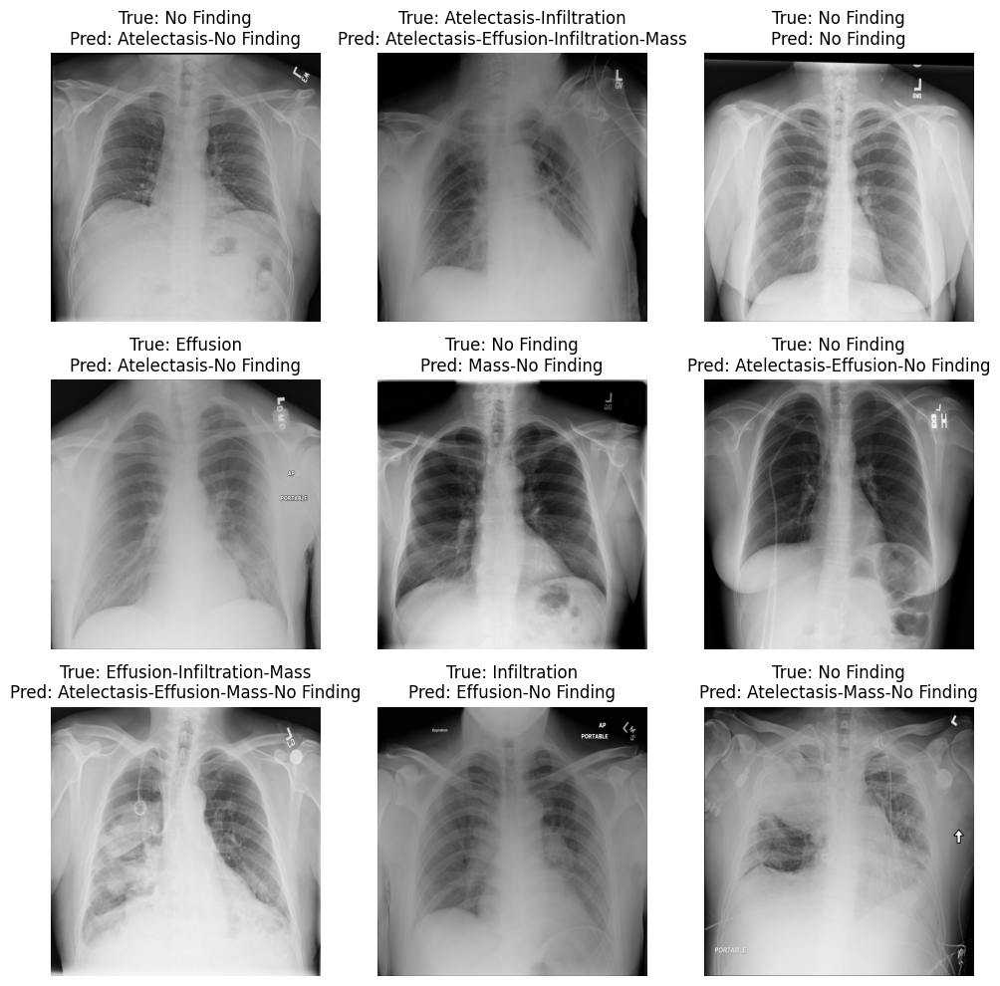

# chest-x-ray-diagnosis using [DenseNet](https://arxiv.org/abs/1608.06993)

## 🏥 Project Overview

[ChestX-ray8 dataset](https://arxiv.org/abs/1705.02315) which contains 108,948 frontal-view X-ray images of 32,717 unique patients. 
- Each image in the data set contains multiple text-mined labels identifying 14 different pathological conditions. 
- These in turn can be used by physicians to diagnose 8 different diseases. 
- We will use this data to develop a single model that will provide binary classification predictions for each of the 14 labeled pathologies. 
- In other words it will predict 'positive' or 'negative' for each of the pathologies.

- Sample datasets is downloaded from [kaggle](https://www.kaggle.com/datasets/nih-chest-xrays/sample)

### About Dataset
NIH Chest X-ray Dataset Sample
National Institutes of Health Chest X-Ray Dataset

Chest X-ray exams are one of the most frequent and cost-effective medical imaging examinations available. However, clinical diagnosis of a chest X-ray can be challenging and sometimes more difficult than diagnosis via chest CT imaging. The lack of large publicly available datasets with annotations means it is still very difficult, if not impossible, to achieve clinically relevant computer-aided detection and diagnosis (CAD) in real world medical sites with chest X-rays. One major hurdle in creating large X-ray image datasets is the lack resources for labeling so many images. Prior to the release of this dataset, Openi was the largest publicly available source of chest X-ray images with 4,143 images available.

This NIH Chest X-ray Dataset is comprised of 112,120 X-ray images with disease labels from 30,805 unique patients. To create these labels, the authors used Natural Language Processing to text-mine disease classifications from the associated radiological reports. The labels are expected to be >90% accurate and suitable for weakly-supervised learning. The original radiology reports are not publicly available but you can find more details on the labeling process in this Open Access paper: "ChestX-ray8: Hospital-scale Chest X-ray Database and Benchmarks on Weakly-Supervised Classification and Localization of Common Thorax Diseases." (Wang et al.)

## 🌟 Key Features

- Multi-label classification of 14 different chest pathologies
- DenseNet121 and ResNet50V2 architecture with custom head used for training
- Experiment tracking using MLflow
- Class imbalance handling through specialized [weighted loss](src/weighted_loss/weighted_loss.py) and [focal loss](src/focal_loss/focal_loss.py)
- Comprehensive evaluation metrics (precision, recall, F1-score, AUC)

## 🧠 Technical Approach

### Model Architecture

The scropt is built on DenseNet121, chosen for its ability to maintain feature propagation, encourage feature reuse, and reduce parameters. The architecture was modified to handle the specific challenges of chest X-ray interpretation.

## 📊 Performance Highlights

Here's a breakdown of the model's performance, as reflected in the classification report:

|               | Precision | Recall | F1-Score | Support |
| :------------ | :-------- | :----- | :------- | :------ |
| Atelectasis   | 0.19      | 0.71   | 0.29     | 102     |
| Effusion      | 0.32      | 0.52   | 0.40     | 129     |
| Infiltration  | 0.32      | 0.34   | 0.33     | 193     |
| Mass          | 0.10      | 0.51   | 0.16     | 57      |
| No Finding    | 0.65      | 0.93   | 0.77     | 609     |
| **Micro Avg** | 0.41      | 0.74   | 0.52     | 1090    |
| **Macro Avg** | 0.32      | 0.60   | 0.39     | 1090    |
| **Weighted Avg**| 0.48      | 0.74   | 0.57     | 1090    |
| **Samples Avg** | 0.50      | 0.76   | 0.57     | 1090    |

**Key Observations:**

*   **Class-Specific Performance:** The model demonstrates varying performance across different pathologies. For instance, it performs well in identifying "No Finding" (high precision, recall, and F1-score) but struggles with "Mass" (low precision and F1-score).
*   **Micro, Macro, Weighted, and Samples Averages:** These averages provide a holistic view of the model's performance. The micro average is influenced by class imbalance, while the macro average treats all classes equally. The weighted average accounts for class support, and the samples average is relevant for multi-label classification.
* **Support:** The support column indicates the number of true instances for each label in the test dataset.

**Interpretation:**

The table above shows the model's ability to correctly identify each pathology (precision), its ability to find all instances of each pathology (recall), and the harmonic mean of precision and recall (F1-score). The support column shows the number of actual occurrences of each pathology in the test set. The averages provide a summary of the model's overall performance.

## 🖼️ Model Predictions

*Examples of the model's predictions on test images, showcasing its ability to identify various pathologies.*

## 🛠️ Technologies Used
- tensorflow:25.02-tf2-py3 Docker image from [Nvidia](https://docs.nvidia.com/deeplearning/frameworks/tensorflow-release-notes/rel-25-01.html#) to avoid GPU detection errors by Tensorflow
- MLflow experiment tracking

## 🚀 Future Enhancements
- use multiple models such as Mobilenetv3, inceptionresnetv2 and so on
- use template and strategy pattern to easily add more models

## 👨‍💻 Installation and Usage

1. Clone the Repo
2. Install vs code with [docker](https://marketplace.visualstudio.com/items?itemName=ms-azuretools.vscode-docker) and [devcontainer](https://marketplace.visualstudio.com/items?itemName=ms-vscode-remote.remote-containers) extension
3. press `Ctrl+Shift+P` and select `Dev Containers: Rebuild and Reopen in Container`
4. setup .env file with kaggle keys to download dataset directly (move it into datasets dir)
5. open conf/config.yaml for configuring parameters and path

## 📄 License

This project is licensed under the MIT License - see the [LICENSE.md](LICENSE.md) file for details.

---
## 📚 Reference
* https://www.kaggle.com/datasets/nih-chest-xrays/sample
* https://www.kaggle.com/code/paultimothymooney/predicting-pathologies-in-x-ray-images/input
* https://github.com/tamerthamoqa/CheXpert-multilabel-classification-tensorflow/tree/master
